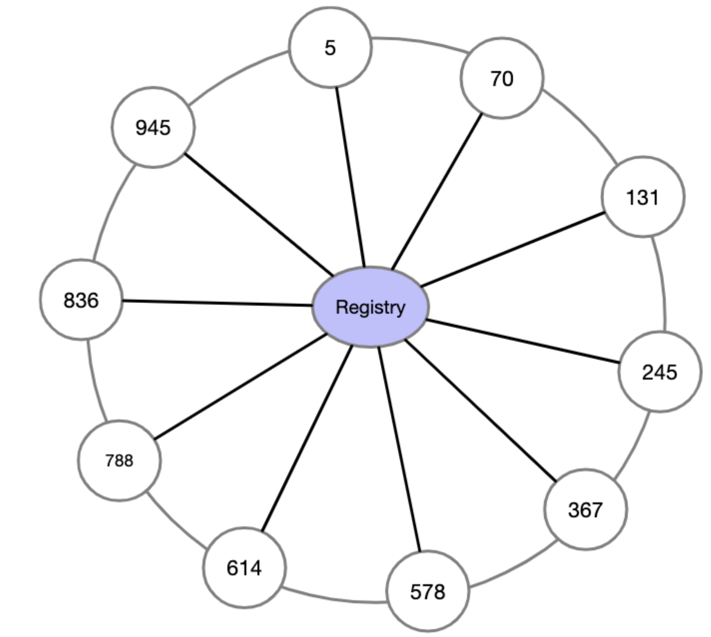

# 455_a1

## Contributors
- Greyson Sequino - greyson.sequino@colostate.edu
- Daniel Reynolds - dr101@colostate.edu
- Matt Young - matt.young@rams.colostate.edu

## About
This project was created to explore programming in a distributed setting. Our architecture consists of one registry and 10 messaging nodes. The registry is responsible for orchestrating the messaging nodes. The messaging nodes are responsible for creating and passing payloads to their assigned partner.

## How to run
After extracting the tar, follow these steps to run the system on machines in the CSU computer science building.
1. cd into the cs455.overlay folder
2. start a tmux session using `tmux`
3. run `./scripts/run_on_all.sh`

## Overlay
The overlay is a logical organization of the messaging nodes and registry. It consists of a wheel and spoke structure where the registry is the hub and the messaging nodes lie along the edge (visual below). The messaging nodes send payloads around the rim and report their statistics to the registry.

## Registry
The registry node accepts registration requests and orchestrates messaging nodes with connection directives and task initiate messages. It also accepts task complete messages from each messaging node to aggregate the statistics of all nodes in the network. Once all messaging nodes finish their tasks the registry reports the statistics of each messaging node and the registry prints the aggregated statistics.

## Messaging Node
The messaging nodes establish a connection with the registry using a registration request, recieve their partner information with a connection directive message, start generating payloads with task initiate messages, and forward all messages that orignated from other messaging nodes onto their partner.